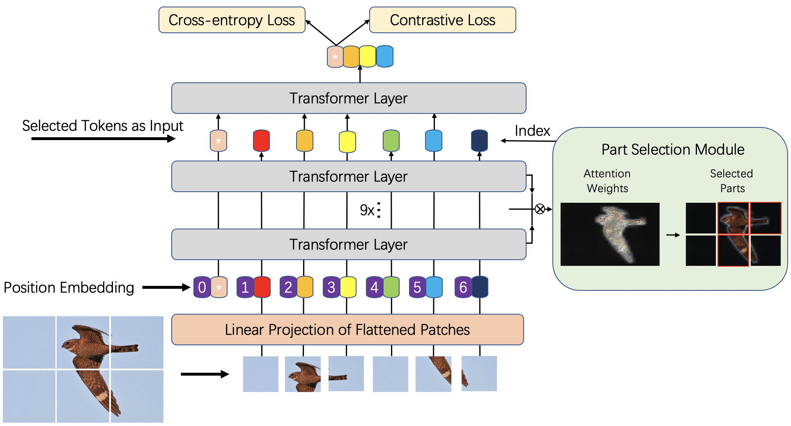

# TransFG: Reproduction Using Jittor

## Framework



## Dependencies:
+ Python 3.8+
+ Jittor 1.3.9.2
+ ml_collections
+ gradio

## Usage
### 1. Download Google pre-trained ViT models

* [Get models in this link](https://console.cloud.google.com/storage/vit_models/): ViT-B_16, ViT-B_32...
```bash
wget https://storage.googleapis.com/vit_models/imagenet21k/{MODEL_NAME}.npz
```

### 2. Prepare data

In the paper, we use data from 5 publicly available datasets:

+ [CUB-200-2011](https://www.kaggle.com/datasets/wenewone/cub2002011)
+ [Stanford Cars](https://huggingface.co/datasets/tanganke/stanford_cars)
+ [Stanford Dogs](http://vision.stanford.edu/aditya86/ImageNetDogs/)
+ [NABirds](https://dl.allaboutbirds.org/nabirds)

Please download them from the official websites and put them in the corresponding folders.

### 3. Install required packages

Install dependencies with the following command:

```bash
pip3 install -r requirements.txt
```

### 4. Train

To train TransFG on CUB-200-2011 dataset with 4 gpus in FP-16 mode for 10000 steps run:

```bash
bash scripts/train_cub_jt.sh
```

### 5. demo

To run the demo, run the following command:

```bash
bash scripts/demo.sh
```

The demo will be available at http://localhost:7860.


## Acknowledgement

Many thanks to [TransFG](https://github.com/TACJu/TransFG) for the PyTorch reimplementation of [TransFG: A Transformer Architecture for Fine-grained Recognition](https://arxiv.org/pdf/2103.07976)